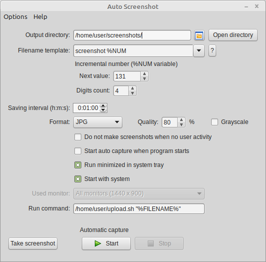

[:uk: EN](README.md "English")&nbsp;&nbsp;
[:ru: RU](README-ru.md "Russian")

---
Auto Screenshot
===============

## Aperçu

**Auto Screenshot** — un logiciel pour automatiser vos prises de captures d'écran avec un intervalle de temps spécifié.

## Fonctionnalités

* Sauvegarde automatique de captures en plein écran avec un intervalle de temps spécifié (de 1 seconde à 24 heures)
* Sauvegarde d'images au format PNG, JPEG, BMP, TIFF `<!--ou GIF-->`
* Mettre en pause la capture d'écran lorsque l'utilisateur est inactif (en fonction des mouvements de la souris et des évènements du clavier)
* Nom des fichiers de sortie modifiable avec des variables (date, temps, utilisateur, nom de l'hôte, numéro de séquence) and habilité de grouper par dossier (par exemple : par jour ou par mois)
* Les captures peuvent être faites automatiquement au démarrage du système
* Support des multiples écrans
* Prise en charge haute définition
* Peut exécuter des commandes personnalisées après la prise de la capture d'écran
* Absolument gratuit et open source

## Captures d'écrans

## Langues

* Anglais
* [Russe](README-ru.md)
* Chinois
* Ukrainien
* Portugais
* Espagnol
* Turc
* Allemand
* [Français](README-fr.md)

[(Aidez-nous avec de nouvelles traductions)](https://github.com/artem78/AutoScreenshot/issues/5)

## Systèmes d'exploitations compatibles  

* Microsoft Windows XP ou plus récent (32/64-bit)
* Linux

## Télécharger
### Version Windows

La dernière version pour Windows est disponible [ici](https://github.com/artem78/AutoScreenshot/releases/latest). Vous pouvez choisir entre la version portable zip ou l'installeur.

### Version Linux
[Télécharger](https://github.com/artem78/AutoScreenshot/releases/tag/v1.10.4-linux.alpha.1)

Noter que c'est une **Alpha** et certaines fonctionnalités de la version Windows ne sont pas encore implémentées  

## Comment puis-je aider ?
* [Rapport sur le bug détecté](https://github.com/artem78/AutoScreenshot/issues/new?assignees=&labels=bug&template=bug_report.md&title=)
* [Suggérer une nouvelle idée ou fonctionnalité](https://github.com/artem78/AutoScreenshot/issues/new?assignees=&labels=enhancement&template=feature_request.md&title=)
* [Faire une nouvelle traduction](https://github.com/artem78/AutoScreenshot/issues/5)
* [Faire un don](#donate)

## Licence
Vous êtes libre d'utiliser, modifier ou distribuer ce logiciel sous la licence [GNU GPL v3.0](https://github.com/artem78/AutoScreenshot/blob/master/LICENSE.txt).

## Auteur
Artem78 (email: [megabyte1024@ya.ru](mailto:megabyte1024@ya.ru?subject=AutoScreenshot))

## Faire un don
PayPal: megabyte1024@yandex.com

ETH Ethereum: 0xB14C877b2eAF7E3b4b49df25039122C0545edA74
