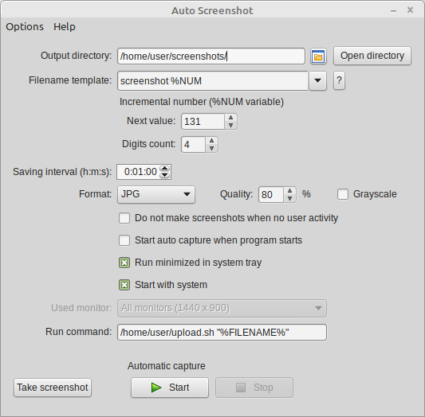

Auto Screenshot
===============

## Обзор
**Auto Screenshot** — программа для Windows, которая автоматически сохраняет снимки рабочего стола через заданный интервал времени.

<!-- ToDo: Для чего оно надо? -->

## Основные возможности
* Автоматическое сохранение скриншотов всего экрана через заданный временной интервал (от 1 секунды до 24 часов)
* Сохранение изображений в формате PNG, JPEG, BMP, TIFF <!--или GIF-->
* Возможность приостановки захвата при бездействии пользователя (определяется по наличию движений мыши и нажатиям клавиш) 
* Настраиваемые имена выходных файлов с использованием переменных (дата, время, название компьютера/пользователя, порядковый номер снимка) и возможностью группировки по папкам (например, по дням или месяцам)
* Возможность автоматического запуска вместе с Windows
* Захват с нескольких экранов
* Поддержка режима High DPI
* Выполнение произвольных команд после снимка
* Полностью бесплатное ПО с окрытым исходным кодом

## Снимки экрана

## Языки интерфейса
* Английский
* Русский
* Китайский
* Украинский
* Португальский
* Испанский
* Турецкий
* Немецкий

[(Помочь с переводом)](https://github.com/artem78/AutoScreenshot/issues/5)

<!-- ToDo: Написать подробно про шаблоны имён -->

## Операционная система
* Microsoft Windows XP или выше (32/64-битная)
* Linux

## Скачать
Последнюю версию программы вы можете скачать [отсюда](https://github.com/artem78/AutoScreenshot/releases/latest).  Можно выбрать zip-архив или установщик.

## Чем я могу помочь проекту?
* [Сообщить об ошибке](https://github.com/artem78/AutoScreenshot/issues/new?assignees=&labels=bug&template=bug_report.md&title=)
* [Предложить новую идею](https://github.com/artem78/AutoScreenshot/issues/new?assignees=&labels=enhancement&template=feature_request.md&title=)
* [Помочь с переводом на другие языки](https://github.com/artem78/AutoScreenshot/issues/5)
* [Поддержать автора материально](#пожертвования)

## Лицензия
Вы можете свободно использовать, модифицировать и распространять данное ПО на условиях лицензии [GNU GPL v3.0](https://github.com/artem78/AutoScreenshot/blob/master/LICENSE.txt).

## Автор
Artem78 (электропочта для связи: [megabyte1024@ya.ru](mailto:megabyte1024@ya.ru?subject=AutoScreenshot))

## Пожертвования
Если вам понравился проект, вы можете вознаградить автора материально отправив любую сумму через платёжную систему PayPal на адрес <u>megabyte1024@yandex.com</u> (в примечании платежа укажите "Пожертвование на AutoScreenshot").
