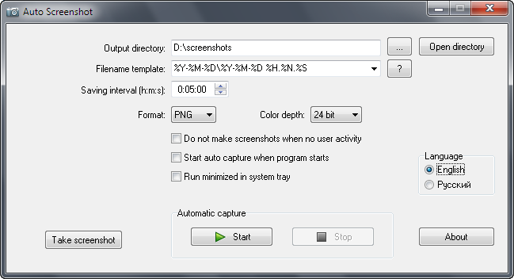

[ RU](README-ru.md "Russian")

-------------------------  

Auto Screenshot
===============

&nbsp;&nbsp;&nbsp;

## Overview
**Auto Screenshot** — Windows application for automatic taking screenshots with specified time interval.

## Features
* Automatic saving screenshots of full screen with specified time interval (from 1 second to 24 hours)
* Saving images in PNG, JPEG, BMP or GIF format
* Pause capture when user is inactive (depending on mouse moves and keyboard events) 
* Customizable output filenames with variables (date, time, user, computer name) and ability of grouping by folders (for example: by day or month)
* Automatic capture can be started on Windows startup
* Multiple screens support

## Screenshots

## Languages
* English
* [Russian](README-ru.md)

[Want more?](https://github.com/artem78/AutoScreenshot/issues/5)

## Supported operation systems
* Microsoft Windows XP or higher (32/64-bit)
* Linux (using [Wine](https://www.winehq.org/))

## Download
The latest version available [here](https://github.com/artem78/AutoScreenshot/releases/latest). You can choose between portable zip or installer.

## How can I help
* Found bug?
https://github.com/artem78/AutoScreenshot/issues/new?assignees=&labels=bug&template=bug_report.md&title=

* Want to suggest new idea?
https://github.com/artem78/AutoScreenshot/issues/new?assignees=&labels=enhancement&template=feature_request.md&title=

* Can add localization for new languages?
https://github.com/artem78/AutoScreenshot/issues/5

## License
You are free to use, modify or distribute this software under the [GNU GPL v3.0](https://github.com/artem78/AutoScreenshot/blob/master/LICENSE.txt) license.

## Author
Artem78 (email: [megabyte1024@ya.ru](mailto:megabyte1024@ya.ru?subject=AutoScreenshot))
