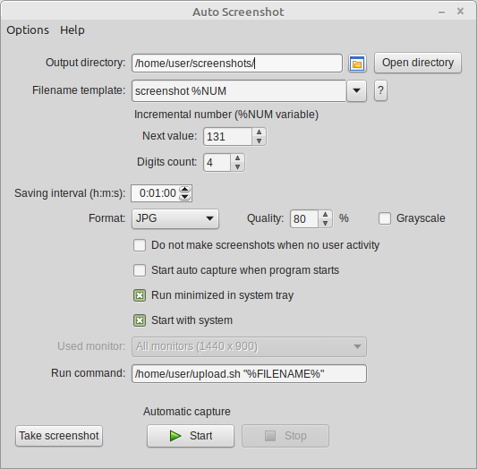

[:fr: FR](README-fr.md "French")&nbsp;&nbsp;
[:ru: RU](README-ru.md "Russian")&nbsp;&nbsp;
[:it: IT](README-it.md "Italian")

-------------------------  

Auto Screenshot
===============

[](https://github.com/artem78/AutoScreenshot/releases/latest)
[](https://github.com/artem78/AutoScreenshot/blob/master/LICENSE.txt)


[](https://github.com/artem78/AutoScreenshot/releases/latest)
[](https://github.com/artem78/AutoScreenshot/releases/latest)

## Overview
**Auto Screenshot** — application for automatic taking screenshots with specified time interval.

## Features
* Automatic saving screenshots of full screen with specified time interval (from 1 second to 24 hours)
* Saving images in PNG, JPEG, BMP, TIFF, WEBP or AVIF format
* Pause capture when user is inactive (depending on mouse moves and keyboard events)
* Customizable output filenames with variables (date, time, user, computer name, sequential number) and ability of grouping by folders (for example: by day or month)
* Automatic capture can be started on system startup
* Multiple screens support
* High DPI support
* Can execute custom command before and after screenshot was taken
* Clearing old screenshots
* Play sound when screenshot taken
* Hotkeys
* Works on Windows and Linux
* Absolutely free and open source

## Screenshots





## Languages
* English
* [Russian](README-ru.md)
* Chinese
* Ukrainian
* Portuguese
* Spanish
* Turkish
* German
* [French](README-fr.md)
* [Italian](README-it.md)

[(Help with new translations)](#Translation)

## Supported operation systems
* Microsoft Windows XP, 7, 8, 10, 11 (32/64-bit)
* Linux

## Download
Download program [here](https://github.com/artem78/AutoScreenshot/releases/).

### Windows
You can choose between portable zip or installer.

### Linux
For Linux portable version and deb package available. Tested with Linux Mint and Ubuntu.

<!--
**Note:** make sure you have installed SSL libraries (including development package) to make networking features enabled, such as update checking.
```
sudo apt-get install openssl libssl-dev
```
-->

## Building from sources

Described in [docs/build.md](/docs/build.md)

## How can I help?
* [Report about found bug](https://github.com/artem78/AutoScreenshot/issues/new?assignees=&labels=bug&template=bug_report.md&title=)
* [Suggest new idea or feature](https://github.com/artem78/AutoScreenshot/issues/new?assignees=&labels=enhancement&template=feature_request.md&title=)
* Help with translation
* [Make a donation](#donate)

### Translation

You can edit any translation or create new one. Join this project on Transifex.com: https://app.transifex.com/--334/autoscreenshot/dashboard/

Also you can edit language files directly in the repository. Localization file format and process details described here - https://github.com/artem78/AutoScreenshot/wiki/UI-localization

## License
You are free to use, modify or distribute this software under the [GNU GPL v3.0](https://github.com/artem78/AutoScreenshot/blob/master/LICENSE.txt) license.

## Author
Artem78 (email: [megabyte1024@ya.ru](mailto:megabyte1024@ya.ru?subject=AutoScreenshot))

## Donate
- PayPal: megabyte1024@yandex.com
- ETH Ethereum / Tether USDT: 0xB14C877b2eAF7E3b4b49df25039122C0545edA74
- Webmoney WMZ: [Z598881055273](https://pay.web.money/d/kgfx)
- Sberbank card: 5469 4009 8490 5476
- ЮMoney (yoomoney): [4100 1195 0619 6001](https://yoomoney.ru/to/4100119506196001)

### Sponsors
| Date      | Name          | Amount |
|-----------|---------------|--------|
| oct. 2021 | Jonas Herdick | 45 EUR |

## Links
- [Auto Screenshot website](https://artem78.github.io/AutoScreenshot/)
- [Auto Screenshot - Translation files on Transiflex](https://app.transifex.com/--334/autoscreenshot/dashboard/)
