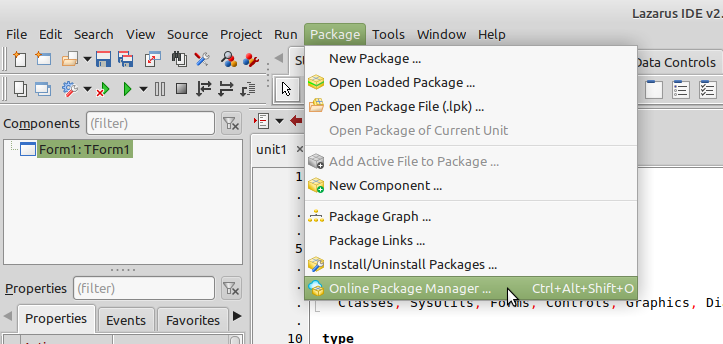
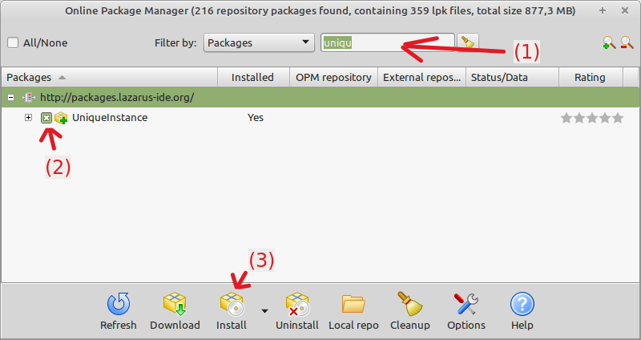
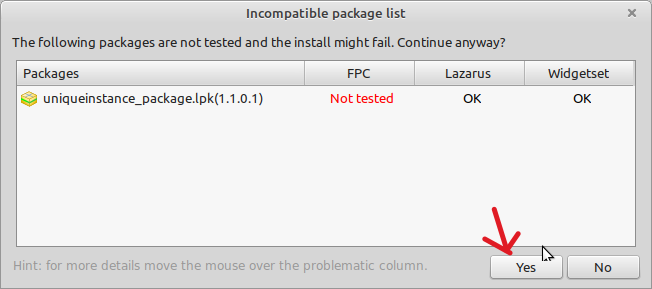
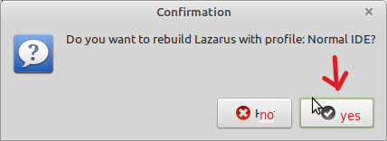
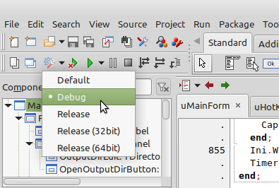

# How to build AutoScreenshot from sources

1) Download project sources
   ```
   git clone git@github.com:artem78/AutoScreenshot.git --recurse-submodules
   ```
2) Download and install Lazarus IDE + Free Pascal Compiler (FPC) - https://www.lazarus-ide.org/index.php?page=downloads . This software was written with old version 2.2.4 while latest Lazarus version for now is 4.6. I'm not sure if it can be succesfully built in modern versions and recommend to install [2.2.4](https://sourceforge.net/projects/lazarus/files/Lazarus%20Windows%2064%20bits/Lazarus%202.2.4/).
   - If you use Windows you should download lazarus-XXXXX-fpc-XXXXX-win64.exe file
   - For Linux install 3 packages (in this order) - fpc-src_XXXXX.deb, fpc-laz_XXXXXX.deb, lazarus-project_XXXXXX.deb
3) Install additional packages for Lazarus IDE
    * Open package manager
    
      
      
    * Find and install these packages one by one: PlaySoundPackage / playwavepackage.lpk, BGRABitmap / bgrabitmappack.lpk, Uniqueinstance / uniqueinstance_package.lpk
    
      
      
      
      
      
      
    * IDE will reboot after each package installation
4) Download sqlite3.dll **(FOR WINDOWS ONLY)**
    * Go to https://sqlite.org/download.html
    * Scroll to "Precompiled Binaries for Windows"
    * Download ZIP for your arch. (more likely sqlite-dll-win-x64-XXXXXX.zip)
    * From arhive extract file `sqlite3.dll` to the project directory
6) In Lazarus IDE go to `Project` -> `Open project...` and select `AutoScreenshot.lpi` file in project sources dir
7) Choose `Debug` build mode and press green arrow (or F9)

   
